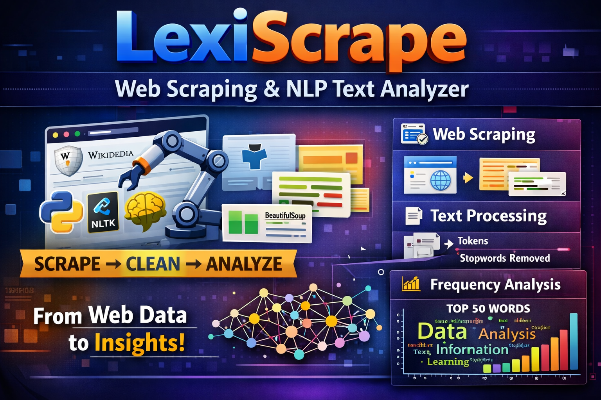

<p align="center">
  
</p>

# 🚀 LexiScrape – Web Scraping & NLP Text Analyzer

LexiScrape is a Python-based project that combines **Web Scraping** and **Natural Language Processing (NLP)** to extract, clean, and analyze textual data from web pages.
This project demonstrates a complete mini NLP pipeline — from raw HTML data to meaningful insights.

---

## 🌐 Key Features

* 🔍 Extracts real-time data from websites (Wikipedia)
* 🧾 Parses HTML content using BeautifulSoup
* 🔤 Tokenizes raw text into meaningful words
* 🧹 Removes stopwords using NLTK
* 📊 Performs word frequency analysis
* 📈 Visualizes top frequent words using graphs

---

## 🛠️ Tech Stack

* **Python**
* **BeautifulSoup (bs4)**
* **NLTK (Natural Language Toolkit)**
* **Matplotlib**
* **HTML5lib**

---

## ⚙️ Project Workflow

1. 🌐 Fetch web content from a URL
2. 🧾 Parse HTML and extract text
3. 🔤 Tokenize text into words
4. 🧹 Remove unnecessary stopwords
5. 📊 Compute word frequency distribution
6. 📈 Visualize top frequent words

---

## 📂 Project Structure

```
LexiScrape/
│── main.py
│── README.md
│── requirements.txt
│── .gitignore
```

---

## ▶️ How to Run

### 1️⃣ Clone the Repository

```bash
git clone https://github.com/selvan-01/LexiScrape.git
cd LexiScrape
```

### 2️⃣ Install Dependencies

```bash
pip install -r requirements.txt
```

### 3️⃣ Run the Project

```bash
python main.py
```

---

## 📊 Output

* Displays a graph of the **Top 50 Most Frequent Words**
* Helps identify key terms and patterns from web content

---

## 💡 Use Cases

* Text Analysis & Keyword Extraction
* Data Science & NLP Learning
* Content Analysis
* Web Data Mining

---

## 🚀 Future Enhancements

* 🌍 Support multiple websites dynamically
* 🤖 Add sentiment analysis
* 🧠 Use advanced NLP models (SpaCy / Transformers)
* 🌐 Build a web interface (Flask / Streamlit)

---

## 📌 Conclusion

LexiScrape is a beginner-friendly yet powerful project that showcases how **web data can be transformed into meaningful insights using NLP techniques**.

---

## 🔗 Links

- 💼 [LinkedIn](https://www.linkedin.com/in/senthamil45)
- 🌍 [Portfolio](https://senthamill.vercel.app/)
- 💻 [GitHub](https://github.com/selvan-01/LexiScrape.git)

⭐ If you found this project useful, consider giving it a star!
